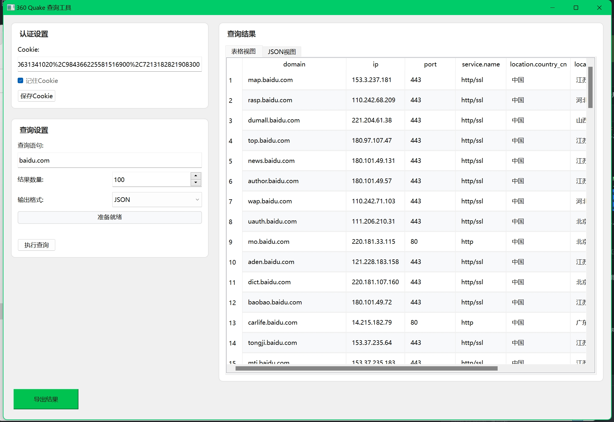

# 360Quake 查询工具

一个基于 PyQt6 开发的 360 Quake 网络空间测绘引擎查询工具，提供了简单直观的图形界面，支持多种数据导出格式。

[](https://github.com/RiderTimeDecade/360quake/blob/main/LICENSE)
[](https://www.python.org/downloads/)
[](https://pypi.org/project/PyQt6/)

## 功能特点

- 现代化的图形用户界面
- 支持大规模数据查询（最多100,000条结果）
- 实时查询进度显示
- 多种导出格式（JSON、CSV、URL）
- 支持 Cookie 认证管理
- 跨平台支持（Windows、macOS、Linux）
- 异步查询，避免界面卡顿
- 支持查询结果表格排序和过滤

## 安装说明

### 使用预编译版本

直接从 [Releases](https://github.com/RiderTimeDecade/360quake/releases) 页面下载对应平台的可执行文件：

- Windows: `360Quake查询工具_windows.exe`
- macOS: `360Quake查询工具_darwin.app`
- Linux: `360Quake查询工���_linux`

### 从源码构建

1. 克隆仓库并进入目录：
```bash
git clone https://github.com/RiderTimeDecade/360quake.git
cd 360quake
```

2. 安装依赖：
```bash
pip install -r requirements.txt
```

3. 运行程序：
```bash
python main.py
```

4. 构建可执行文件：
```bash
python build.py
```

## 使用说明

### 程序界面



1. 启动程序后，在认证设置区域输入您的 360 Quake Cookie
2. 在查询设置区域输入查询语句（支持标准的 Quake 查询语法）
3. 设置需要获取的结果数量（1-100000）
4. 选择导出格式（JSON、CSV 或 URL 格式）
5. 点击"执行查询"按钮开始查询
6. 查询完成后可以查看结果或导出数据

### 查询语法示例

- 域名查询：`domain: "example.com"`
- IP 查询：`ip: "1.1.1.1"`
- 端口查询：`port: 443`
- 服务查询：`service: "http"`
- 组合查询：`service: "http" AND country: "China"`

### 导出格式说明

1. JSON 格式：完整的查询结果，包含所有字段
2. CSV 格式：表格形式，包含常用字段，方便在 Excel 中处理
3. URL 格式：`protocol://ip:port` 格式，方便直接访问服务

## 项目结构

```
360quake/
├── main.py              # 程序入口
├── build.py            # 构建脚本
├── requirements.txt    # 依赖列表
├── src/
│   ├── config/        # 配置文件
│   ├── core/          # 核心功能
│   ├── ui/            # 用户界面
│   └── utils/         # 工具函数
└── assets/            # 资源文件
```

## 技术栈

- Python 3.8+
- PyQt6 6.6.1
- requests 2.31.0
- PyInstaller 6.3.0

## 常见问题

1. **为什么需要输入 Cookie？**
   - Cookie 用于 360 Quake 的身份认证，可以从浏览器登录 360 Quake 后获取

2. **如何获取 Cookie？**
   - 登录 [360 Quake](https://quake.360.net/)
   - 打开浏览器开发者工具（F12）
   - 在 Network 标签页中找到任意请求
   - 在请求头中复制 Cookie 字段的值

3. **查询结果数量限制是多少？**
   - 单次查询最多支持 100,000 条结果
   - 实际可查询数量取决于您的 360 Quake 账户权限

4. **程序支持哪些平台？**
   - Windows 7 及以上版本
   - macOS 10.14 及以上版本
   - 主流 Linux 发行版

## 贡献

欢迎提交 Issue 和 Pull Request！

## 许可证

本项目采用 [MIT 许可证](LICENSE) 